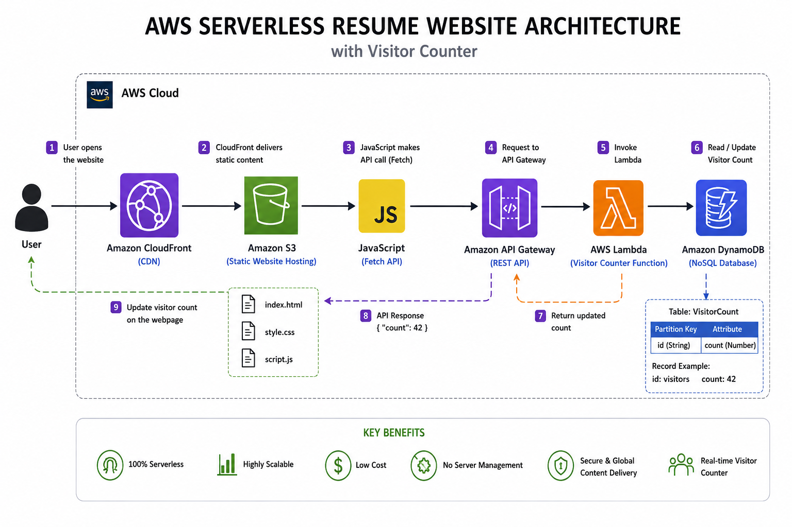
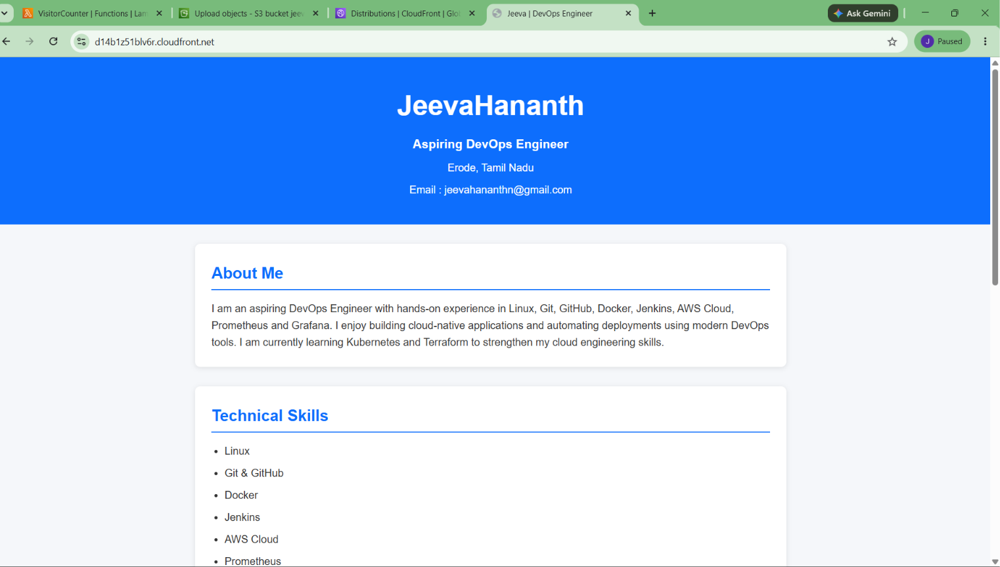
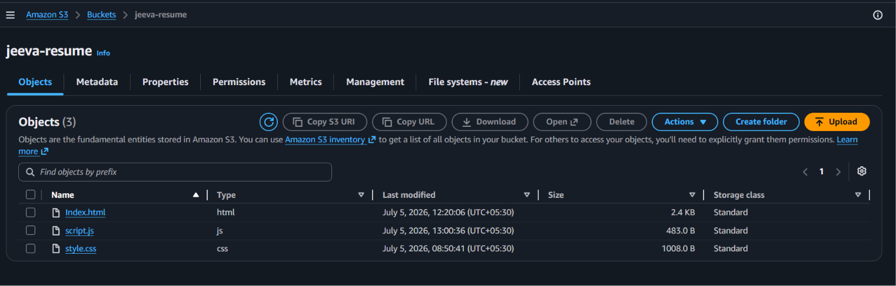
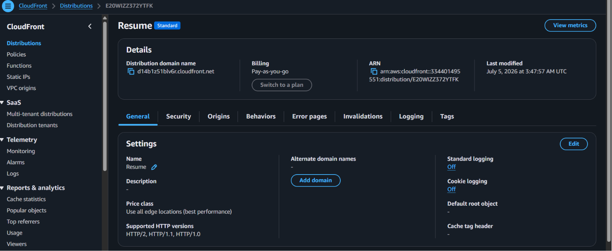
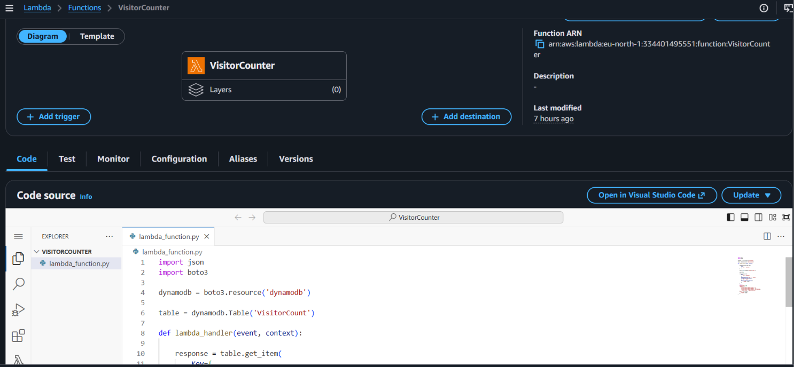
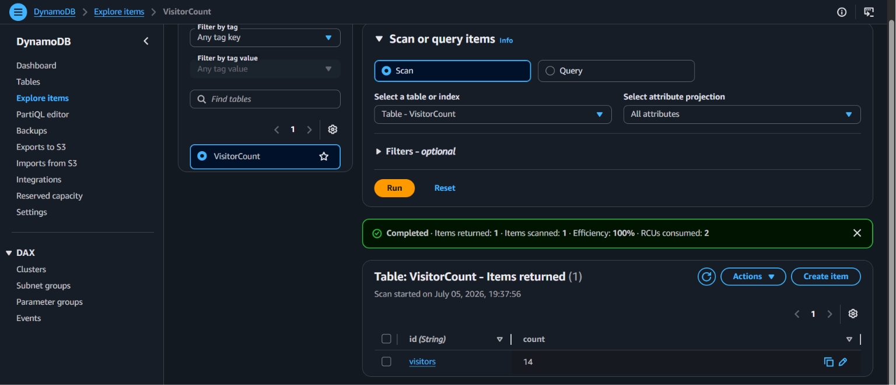
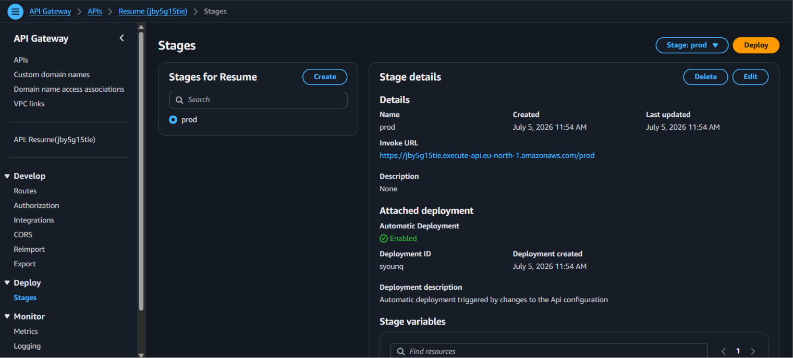

# AWS Serverless Resume Website

## Project Overview

This project is a serverless resume website built using AWS cloud services. The website is hosted on Amazon S3 and delivered securely using Amazon CloudFront. A real-time visitor counter is implemented using API Gateway, AWS Lambda, and DynamoDB.

The project demonstrates practical knowledge of serverless architecture, cloud storage, content delivery, REST APIs, NoSQL databases, IAM permissions, and frontend-backend integration.

---

## Architecture

```
                User
                  │
                  ▼
            CloudFront CDN
                  │
                  ▼
          Amazon S3 Website
                  │
                  ▼
           JavaScript Fetch API
                  │
                  ▼
             API Gateway
                  │
                  ▼
             AWS Lambda
                  │
                  ▼
              DynamoDB
```

---

## AWS Services Used

| Service | Purpose |
|----------|----------|
| Amazon S3 | Static website hosting |
| CloudFront | Content Delivery Network |
| API Gateway | REST API |
| AWS Lambda | Backend logic |
| DynamoDB | Visitor count storage |
| IAM | Access permissions |

---

## Features

- Static Resume Website
- HTTPS using CloudFront
- Serverless Architecture
- Dynamic Visitor Counter
- REST API Integration
- No Server Management
- Low Cost
- Highly Scalable

---

## Workflow

1. User opens the resume website.
2. CloudFront serves the website.
3. JavaScript calls API Gateway.
4. API Gateway invokes Lambda.
5. Lambda reads visitor count from DynamoDB.
6. Lambda increments the count.
7. DynamoDB updates the record.
8. Lambda returns the latest count.
9. JavaScript displays the updated visitor count.

---


## Challenges Faced

- S3 Access Denied (403)
- Bucket Policy Configuration
- IAM Permission Issues
- DynamoDB Decimal Serialization
- API Gateway Route Configuration
- CORS Errors
- CloudFront Cache Invalidation

---

## Learning Outcomes

- Amazon S3 Website Hosting
- CloudFront CDN
- AWS Lambda
- API Gateway
- DynamoDB CRUD Operations
- IAM Roles
- JavaScript Fetch API
- Serverless Architecture
- AWS Troubleshooting

---

## Future Improvements

- Route53 Custom Domain
- SSL Certificate using ACM
- Terraform Automation
- CI/CD using GitHub Actions
- CloudWatch Monitoring
- Infrastructure as Code

---

# AWS Serverless Resume Website

## Architecture



---

## Resume Website



---

## S3 Bucket



---

## CloudFront



---

## Lambda



---

## DynamoDB



---

## API Gateway



---


Skills:

- AWS Cloud
- Linux
- Git
- GitHub
- Docker
- Jenkins
- Prometheus
- Grafana
- Kubernetes (Learning)
- Terraform (Learning)
